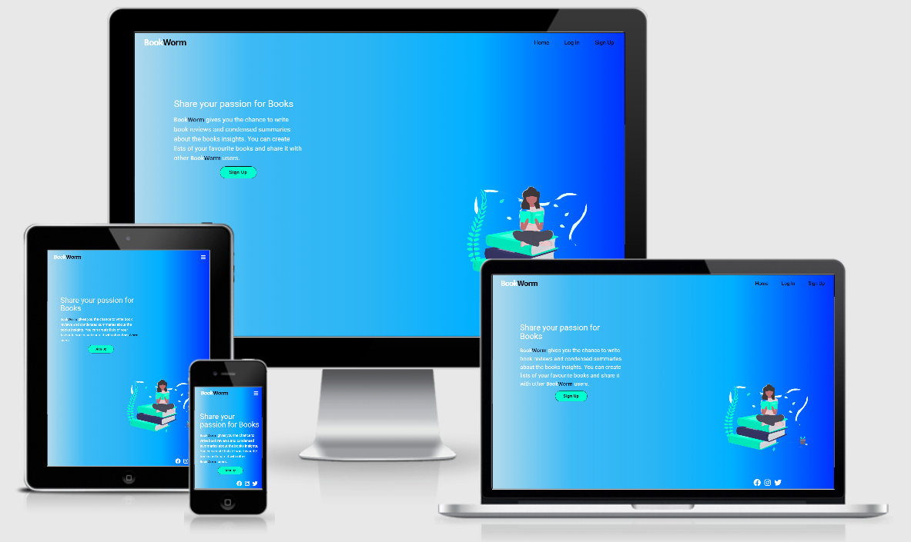
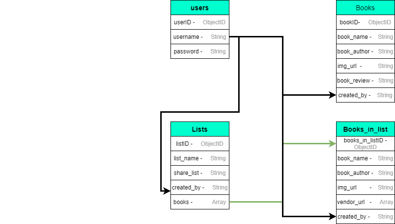

# BooksWorm

This project aims is to provide a place where the user can write down a personal summary of a book and the main insights they 
got from reading a book.
Also, the user will be able to create any list of books they want and share with other users if desired.

## Live demo on Heroku pages [HERE](http://bookworm-ms3.herokuapp.com/home)

## Table of Contents:

- [UX](#ux)
  - [User Stories](#user-stories)
  - [Strategy](#1-strategy)
  - [Scope](#2-scope)
  - [Structure](#3-structure)
  - [Skeleton](#4-skeleton)
  - [Surface](#5-surface)
- [Features](#features)
  - [Existing Features](#existing-features)
  - [Features for the future](#features-for-the-future)
- [Technologies Used](#technologies-used)
  - [Languages](#1-languages)
  - [Integrations](#2-integrations)
  - [Workspace, Version Control, and Repository Storage](#3-workspace-version-control-and-repository-storage)
- [Resources](#resources)
- [Testing](#testing)
- [Deployment](#deployment)
- [Credits](#credits)
  - [Media](#media)
  - [Code](#code)
- [Acknowledgments](#acknowledgments)

## UX

### User Stories

- As a user, I want to easily understand the main purpose of the site and learn more about the organisation.
- As a user, I want to easily sign up to the website.
- As a user, I want to easily log in on my account.
- As a user, I want to write personal summaries and main insights about the books I'm reading or already read.
- As a user, I want to create a list of books and share it with other users.
- As a user, I want to find list of books from other people and get inspired to read other books.
- As a user, I want to a way to buy the books in the lists.
- As a user, I want to update or delete old book summaries and lists of books.

### 1. Strategy

- Provide a platform where the user can create personal summaries about books they read.
- Provide a platform where user can create a list of books and share it with other users if they want.
- Create an enjoyable, and easy to use platform that makes the user uses it frequently.

### 2. Scope

- Fits in with  current skill-set of HTML, CSS, JavaScript, Python, Flask and MongoDB.
- Easy way to sign up into the website with Sign Up Button for new users.
- Easy way to log in into the website.
- Allow the user to create, read, update and delete their personal reviews.
- Allow the user to create, read, update, delete and share their wish lists.

### 3. Structure

As the website has two main ideas, create personal book summaries and lists of books, the website is kept as simple possible 
and easy to use.

- A part of the home page, every page has the same structure to keep consistency and to make the navigation easy to assimilate.
- The modals in different pages are very similar to each other to keep consistency.

### 4. Skeleton

- [Wireframes](static/wireframes)
- Navigation bar - Menu with links pointing to each page
  - **Home** -  A short description letting the user knows what the website is about.
  - **Sign Up / Log In** - Very similar design to keep consistency and be user friendly.
  - **Profile** - After users sign up, they are redirected to their profile with a flash message welcoming them and advise to create 
  their first book summary.
  - **My Books** - A very similar design of the profile page. Until users create their first list a message will be display 
  encouraging then to do it.
  - **View Books / View Lists** - Two similar pages where the user can see books and lists with more details. Also, they can edit 
  and delete it.
  - **Recommendation** - Allows the users to see the shared list from other users. The same design from My Books page used to keep familiarity.
- Database Diagram

### 5. Surface
The overall UX is clean and similar in all pages to keep consistency.

### Colors:
The basic colors used are a light blue #00B0FF, a darker blue #0031FF and a light green #00FFCF building an analogous color palette. Some different blue/light green tones were 
also chosen to enhance the design.

### Typography :

"Roboto" font (with fall-back font of Sans-Serif) is used in all website. Unless the logo that uses "Mukta" font (with fall-back 
font of Sans-Serif).

### Images:
Only a few images were used in the website and all of them have #00FFCF colour, as a base colour and them different tones.

## Features
### Existing Features

- Designed with HTML5, CSS3, JavaScript, Python3, Flask, MongoDB and Materalize.
- Responsive navigation bar.
- Button to create book summaries and enter information into a modal.
- Button to create a list of books.
- Button to share a list of books.
- Section where user can edit and delete summaries and lists.
- Footer with social media links.

### Features to consider implementing in the future

- Sign Up with email, lost password functionality
- Like and Dislike functionality
- Add a page where you can filter and search for all books on the site

## Technologies Used

### 1. Languages

- [HTML5](https://en.wikipedia.org/wiki/HTML5)
- [CSS](https://en.wikipedia.org/wiki/CSS)
- [JavaScript](https://en.wikipedia.org/wiki/JavaScript)
- [Python](<https://en.wikipedia.org/wiki/Python_(programming_language)>)

### 2. Integrations

- [Google Fonts](https://fonts.google.com/) - Typography.
- [FontAwesome](https://fontawesome.com/) - Used for icons.
- [Materalize](https://materializecss.com/) - CSS framework.
- [jQuery](https://jquery.com/) - JavaScript library.
- [Flask](https://flask.palletsprojects.com/en/1.1.x/) - Micro web framework written in Python.
- [MongoDB](https://www.mongodb.com/) - NoSQL database program, using JSON-like documents.

### 3. Workspace, version control, and repository storage

- [Gitpod](https://www.gitpod.io/) - IDE (Integrated Development Environment) used to write the code.
- [GitHub](https://github.com/) - Repository hosting service to host the deployed website and track previous versions of code.
- [Git](https://git-scm.com/) - Version control tool to record changes and updates to my files.
- [Heroku](https://www.heroku.com/) - Container-based cloud platform for deployment and running of apps.

## Resources

- [W3.CSS](https://www.w3schools.com/w3css/defaulT.asp) - General resource.
- [Stack Overflow](https://pt.stackoverflow.com/) - General resource.
- [Youtube](https://www.youtube.com/) - General resource.
- [CommonMark](https://commonmark.org/) - For Markdown language reference.
- [Balsamiq](https://balsamiq.com/wireframes/) - Wireframing design tool.
- [Autoprefixer](https://autoprefixer.github.io/) - Parses CSS and adds vendor prefixes.
- Code Institute SLACK Community - General Resource

## Code Validation

- [W3C](https://validator.w3.org/) - HTML Markup Validation.
- [Closing Tag Checker for HTML5](https://www.aliciaramirez.com/closing-tags-checker/) - Validates all tags are opening and closing 
correctly.
- [W3C](https://jigsaw.w3.org/css-validator/) - CSS Validation.
- [JSHINT](https://jshint.com/) - JavaScript code warning & error check.
- [PEP8 online](http://pep8online.com/) - PEP8 validator.

## Testing

Testing documentation can be found [HERE](static/testing/TESTING.md)

## Deployment

### Project Creation
- To create this project the [CI Gitpod Full Template](https://github.com/Code-Institute-Org/gitpod-full-template).
- Then create new repository from template page and entered in desired repository name, then click create 
repository from template button.
- Once created, navigate to new repository on GitHub and clicke the Gitpod button which will built the workspace.

### Deployment to Heroku
This project is deployed and hosted on [Heroku](https://www.heroku.com/).
- Navigate to [Heroku](https://www.heroku.com/) and login.
- On the dashboard, click on the 'New' button and select 'Create new app'.
- Enter the app name and select a region.
- Under the 'Settings' tab, click on 'Config Vars' to add Configuration Variables from the env.py file. This includes the IP, Port, 
Secret key, MongoDB name and URI, as well as mail settings for Flask Mail.
- In the menu select the 'Deploy' option.
- Under 'Deployment method' select the GitHub option to connect to your GitHub repository. Ensure GitHub username is selected and 
use the search function to find the relevant repository.
- Select Automatic deploys from the main branch and click 'Deploy Branch'.

### Cloning
- The code can be run locally through clone or download from the repository on GitHub.
- You can do this by opening the repository, clicking on the green 'Code' button and selecting either 'clone or download'.
- The Clone option provides a URL, which you can use on your CLI with **git clone <url>**.
- The Download ZIP option provides a link to download a ZIP file which can be unzipped on your local machine. The files can then 
be uploaded to your IDE

## Credits
### Media
**Illustrations**:
- [Undraw](https://undraw.co/)

### Code
- Dynamically add input fields from Stack Overflow [here](https://www.sanwebe.com/2013/03/addremove-input-fields-dynamically-with-jquery).
